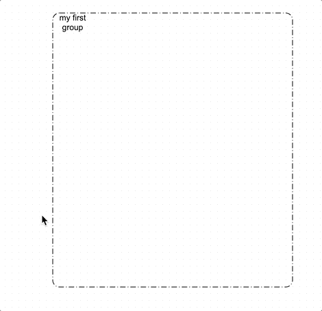

> :warning: :construction: This extension currently works on [diagram-js](https://github.com/bpmn-io/diagram-js) work in progress. This will not be released until the diagram-js [frame elements support](https://github.com/bpmn-io/diagram-js/pull/321) is released.

# diagram-js-frame-outline

diagram-js extension which adds an inner outline for frame elements



## Installation

```sh
$ npm i --save diagram-js-frame-outline
```

## Usage
```js
import BpmnModeler from 'bpmn-js/lib/Modeler';

import frameOutlineModule from 'diagram-js-frame-outline';

var modeler = new BpmnModeler({
  // ...
  additionalModules: [
    frameOutlineModule
  ]
});

```

